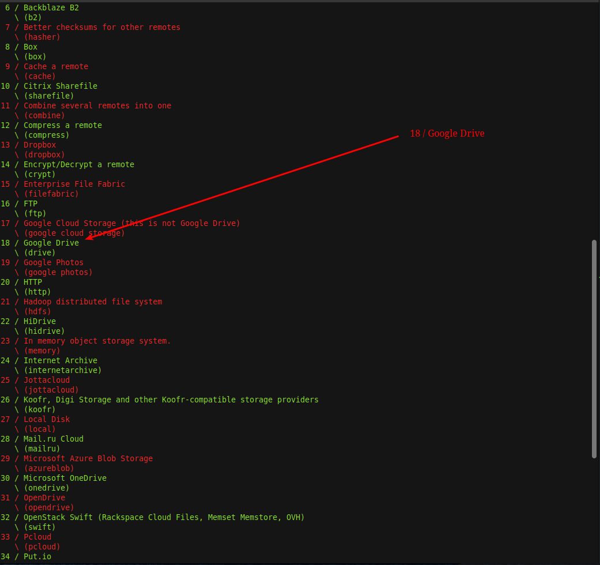
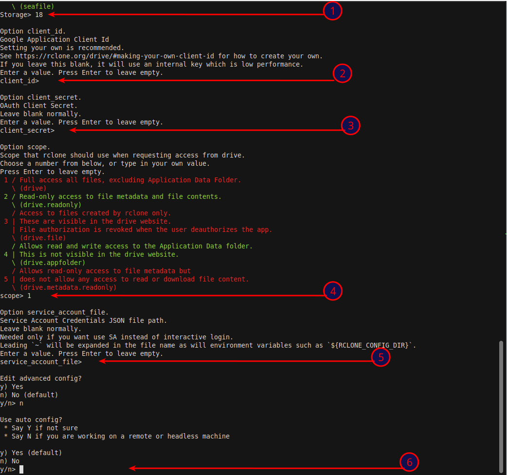
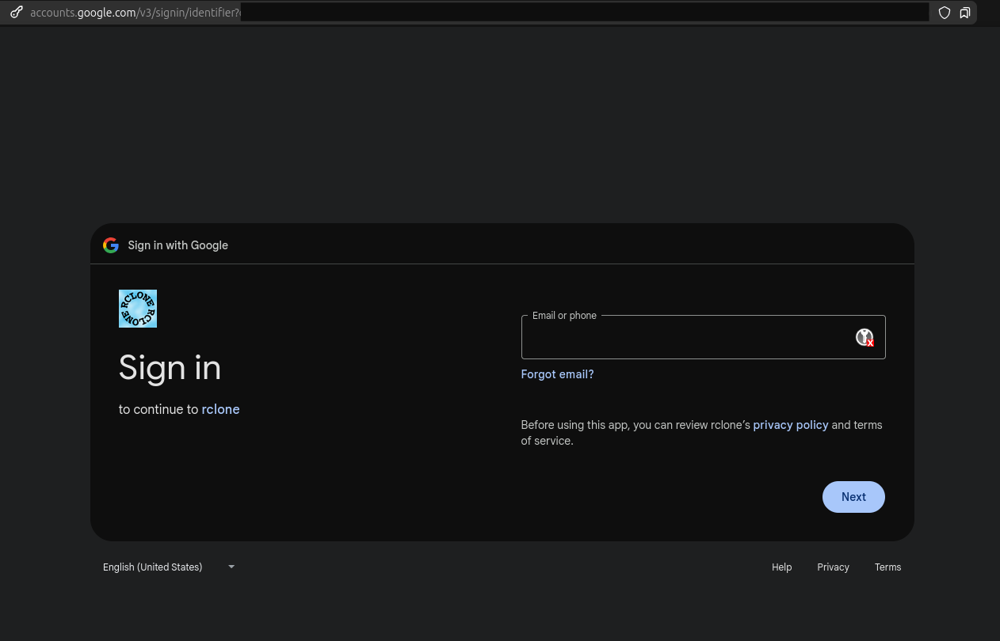

# Google Drive + rclone (montaje FUSE/Bidireccional)

## Objetivo

En este artículo se monta una unidad de Google Drive en el filesystem del sistema Linux, mediante el uso de rclone.

## Instalación de rclone y configuración de la conexión

```bash
sudo apt update
sudo apt install rclone
rclone config
```

En las siguientes imágenes se muestran (comentadas) algunas de las pantallas capturadas de la configuración para el acceso a Google Drive.







## Montando Google Drive en local

```bash
mkdir -pv GDrive
clone mount GDrive: ~/GDrive --vfs-cache-mode full --daemon
```
